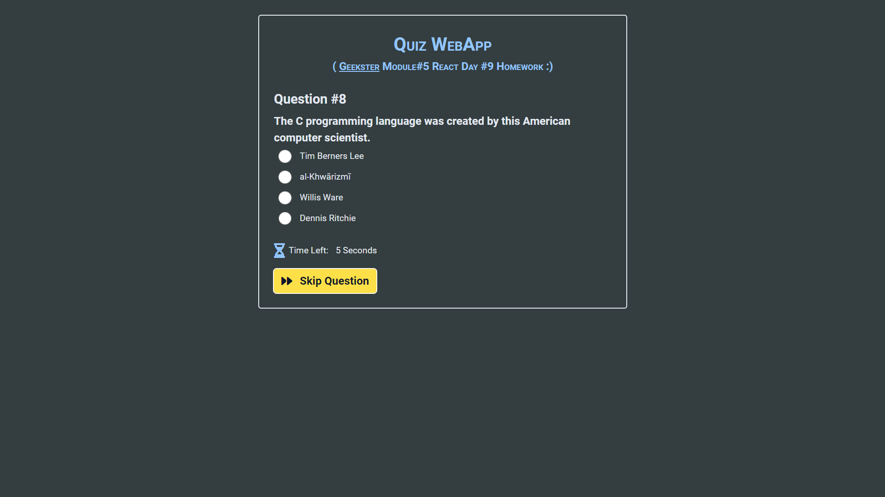

# Module#5 React Day #9 Homework: Quiz WebApp


## Hosted Version of the Project:
[m5react-day-9-homework-quiz-webapp](https://m5react-day-9-homework-quiz-webapp.vercel.app/)

## Objectives
+ Built a Quiz App that retrieves quiz questions from the [OpenDB API](https://opentdb.com/) using the fetch function.
+ Implemented a countdown timer of 5 seconds for each question.
+ Provided four answer options for each question.
+ Displayed the final score to the user at the end of the quiz.


## How to install and run in yours local machine
```bash
npm install
npm run start
```

## Tech. Stack Used:
+ [React](https://react.dev/)
+ [TailwindCSS](https://tailwindcss.com/)
+ [Google Fonts](https://fonts.google.com/)
+ [Font Awesome](https://fontawesome.com/icons/)

## Author
[Abhishek kumar](https://www.linkedin.com/in/alex21c/), ([Geekster](https://geekster.in/) MERN Stack FS-14 Batch)


